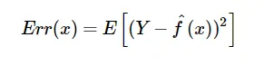
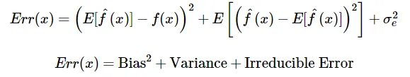
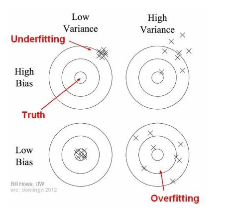

# Understanding the Bias-Variance Trade-Off

[Resource](https://medium.com/data-science/understanding-the-bias-variance-tradeoff-165e6942b229)

To reiterate what you already know...

**What is bias?**

Bias is the difference between the average prediction of our model and the correct value which we are trying to predict. A model with high bias pays very little attention to the training data and oversimplifies the model. It always leads to high error on training and test data.

**What is variance?**

Variance is the variability of model prediction for a given data point or a value which tells us the spread of our data. A model with high variance pays a lot of attention to training data and doesn't generalize on the data which is hasn't seen before. As a result, such models perform very well on training data but has high error rates on test data.

**Mathematically**

Let the variable we're trying to predict be Y and other coefficients are X. We assume there is a relationship between the two such that

Y=f(X) + e

Where e is the error term and it's normally distributed with a mean of 0.

We will make a model f^(X) of f(X) using linear regression or any other modeling technique.

So the expected squared error at a point x is

The Err(x) can be further decomposed as

Err(x) is the sum of bias-squared, variance, and the irreducible error.

Irreducible error is the error that can't be reduced by creating good models. It's a measure of the amount of noise in our data. Here, it's important to understand that no matter how good we make our model, our data will have certain amounts of noise or irreducible error that can not be removed.

# Bias and Variance Using Bulls-Eye Diagram

In supervised learning, **underfitting** happens when a model is unable to capture the underlying pattern of the data. These models usually have high bias and low variance. It happens when we don't have enough data to build an accurate model or when we try to build a linear model with nonlinear data. 

In supervised learning, **overfitting** happens when our model captures the noise along with the underlying pattern in the data. It happens when we train our model too much over a noisy dataset. These models have low bias and high variance. These models are very complex like decision trees which are prone to overfitting.

# The Bias-Variance Trade-Off

If our model is too simple and has very few parameters then it may have a high bias and low variance. On the other hand, if our model is too complex with a large number of parameters then it's likely to have high variance and low bias.