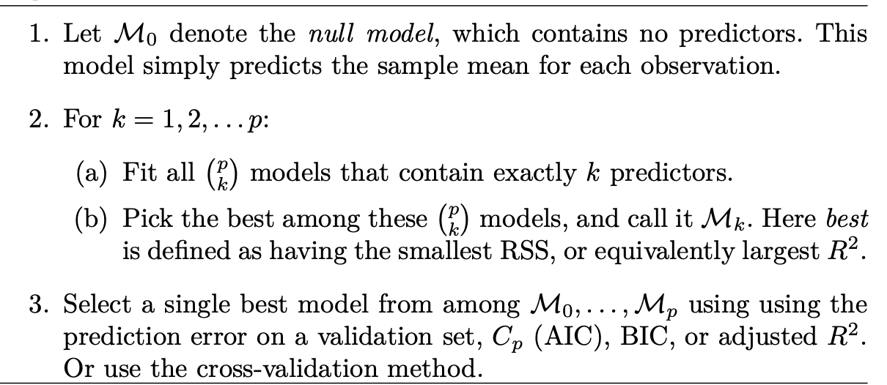
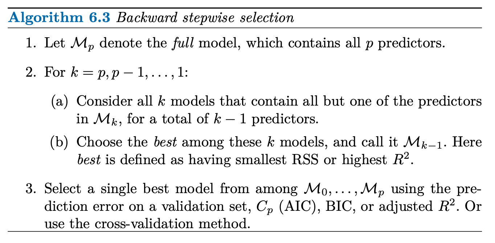
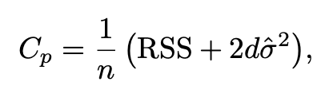
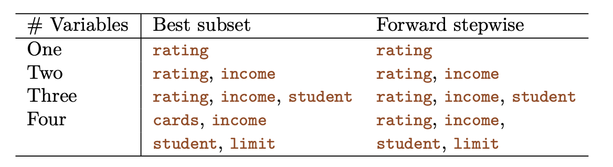
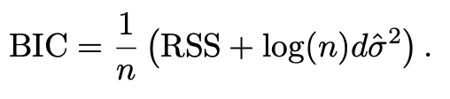
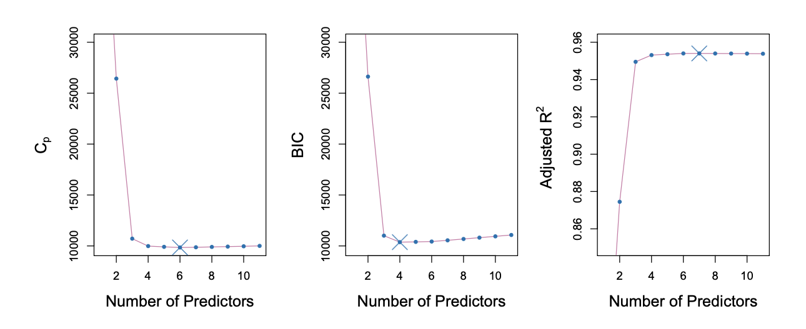
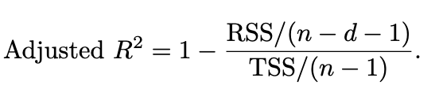
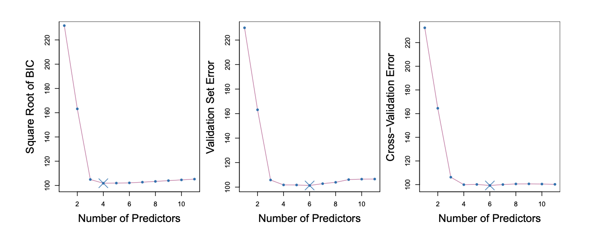
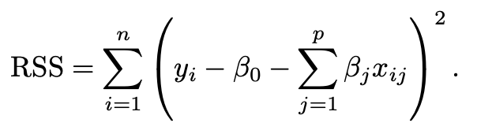
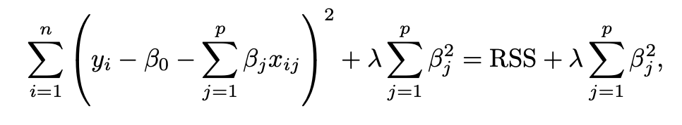

# Linear Model Selection and Regularization

As you only recently learned, the linear model has distinct advantages in terms of inference and, on real-world problems, is often surprisingly competitive in relation to non-linear world problems. Therefore... we're gonna take a look at some ways in which the linear model can be improved by replacing plain least squares fitting with some alternative fitting procedures.

Why might we want to use another fitting procedure instead of least squares? Well let me tell ya son, alternative fitting procedures can yield better prediction accuracy and model interpretability.

* **Prediction Accuracy:** Provided you're actually dealing with a linear problem, the least squares estimate will have a low bias. If n >> p, that is, if n, the number of observations, is much larger than p, the number of variables, then the least least squares estimates tend to have low variance, and will perform well on test observations. However, if n is not much larger than p, then there can be a lot of variability in the least squares fit, resulting in overfitting and consequently poor predictions on future observations not used in model training. And if p > n, then there is no longer a unique least squares coefficient estimate: there are infinitely many solutions. Each of these least squares solutions gives zero error on the training data, but typically very poor test set performance due to extremely high variance. By **constraining** or **shrinking** the estimated coefficients, we can often substantially **reduce the variance at the cost of a negligible increase in bias**.

* **Model Interpretability:** It's often the case that some or many of the variables used in a multiple regression model are in fact not associated with the response. Including such irrelevant variables leads to unnecessary complexity in the resulting model, By removing these variables-that is, by setting the corresponding coefficient estimates to zero-we can obtain a model that's more easily interpreted. Now least squares is extremely unlikely to yield any coefficient estimates that are exactly zero.

There are many alternatives, both classical and modern, to using least squares to fit. In this chapter, we discuss three important classes of methods:

* **Subset Selection:** This approach involves identifying a subset of the *p* predictors that we believe to be related to the response. We then fit a model using least squares on the reduced set of variables.

* **Shrinkage:** This approach involves fitting a model involving all *p* predictors. However, the estimated coefficients ar shrunken towards zero relative to the least squares estimates. This shrinkage (also known as **regularization**) has the effect of reducing variance. Depending on what type of shrinkage is performed, some of the coefficients may be estimated to be exactly zero. Hence, shrinkage methods can also perform variable selection.

* **Dimension Reduction:** This approach involves projecting the *p* predictors into an *M*-dimensional subspace, where *M* < *p*. This is achieved by computing *M* different **linear combinations, or projections**, of the variables. Then these *M* projections are used as predictors to fit a linear regression model by least squared.

# Subset Selection

## Best Subset Selection

To perform **best subset selection**, we fit a separate least squares regression for each possible combination of the *p* predictors. That is, we fit all *p* models that contain exactly one predictor, all p(p-1)/2 models that contain exactly two predictors, and so forth. We then look at all of the resulting models, with the goal of identifying the one that is best.

The problem of selecting the *best model* from among the `2**p` possibilities considered by best subset isn't trivial. This is usually broken up into two stages, as described by the following algorithm:

**Step 2** identifies the best model (on the training data) for each subset size, in order to reduce the problem from one of `2**p` possible models to one of *p* + 1 possible models. In the image below, these models form the lower frontier depicted in red:

In order to select a single best model, we must simply choose among these *p* + 1 options. This task must be performed with care, because the RSS of these *p* + 1 models decreases monotonically (meaning it only decreases relative to the *p* + 1 models), and the R**2 increases monotonically, as the number of features included in the model increases.

Therefore, if we use these statistics to select the best model, then we will always end up with a model involving all the variables. The problem is that a low RSS or a high R-squared indicates a model with a low *training* error, whereas we wish to choose a model that has a low *test* error. Therefore, in **Step 3**, we use the error on a validations set, Cp, BIC, or adjusted R2 in order to select among the *M* values. If cross-validation is used to select the best model, then **Step 2** is repeated on each training fold, and the validation errors are averaged to select the best value of *k*.

**Note:** We will get to cross validation eventually, but it's more essential to finish up linear regression first.

Then the model *Mk* fit on the full training set is delivered for the chosen *k*.

An application of best subset selection is shown in the above graph. Each plotted point corresponds to a least squares regression model fit using a different subset of the 10 predictors in the `Credit` data set. Here, the variable `region` is a three-level qualitative variable, and so is represented by two dummy variables, which are selected separately in this case. Hence, there are a total of 11 possible variables which can be included in the model.

Although we have presented best subset selection here for least squares regression, the same ideas apply to other types of models, such as logistic regression. In the case of logistic regression, instead of ordering models by RSS in Step 2, we instead use the **deviance**, a measure that plays the role of RSS for a broader class of models. The smaller the deviance, the better the fit.

While best subset selection is a simple and conceptually appealing approach, it clearly suffers from computational limitations. You're taking all possible combinations of how to approach the data analysis and it gets increasingly demanding as you add predictors. Consequently, **best subset selection becomes computationally infeasible for values of *p* grater than around 40**.

## Stepwise Selection

Stepwise selection methods explore a far more restricted set of models, and are attractive alternatives to best subset selection.

### Forward Stepwise Selection

**Forward stepwise selection** is a computationally efficient alternative to best subset selection. Instead of considering all `2**p` possible models containing subsets of the *p* predictors, forward stepwise considers a much smaller set of models.

It begins with a model containing no predictors, and then adds predictors to the model, one-at-a-time, until all of the predictors are in the model. At each step **the variable that gives the greatest additional improvement to the fit is added to the model**. The algorithm is as follows:

Unlike best subset selection, which involved fitting `2**p` models, forward stepwise selection involves fitting one null model, along with *p* - *k* models in the *k*th iteration. This provide a substantial difference. For example, when *p* = 20, best subset selection requires fitting 1,048,576 models, whereas forward stepwise selection requires fitting only 211 models.

In Step 2(b) of the previous algorithm, we must identify the best model from among those *p* - *k* that augment *Mk* with one additional predictor. We can do this by simply choosing the model with the lowest RSS or the highest R-squared. However, in Step 3, we must identify the best model among a set of models with different numbers of variables, which is more challenging.

**Though forward stepwise tends to do well in practice, it's not guaranteed to find the best possible model out of all `2**p` models containing subsets of the *p* predictors. 

Forward stepwise selection can be applied even in the high-dimensional setting where *n* < *p*; however, in this case, it's possible to construct submodels only, since each submodel is fit using least squares, which will not yield a unique solution if *p* >= *n*.

### Backward Stepwise Selection

Like forward stepwise selection, backward stepwise selection provides an efficient alternative to best subset selection. However, unlike forward stepwise selection, it begins with the full least squares model containing all *p* predictors, and then iteratively removes the least useful predictor one-at-a-tine. Here's the algorithm for it:

**Backward stepwise selection can be applied in settings where p is too large to apply to best subset selection**. Also like forward stepwise selection, backward stepwise selection is not guaranteed to yield the best model containing a subset of the *p* predictors.

**Backward selection requires that the number of samples n is larger than the number of variables p** (so that the full model can be fit). In contrast, forward stepwise can be used even when n < p, and so is the only viable subset method when p is very large.

## Hybrid Approaches

The best subset selection approaches generally give similar, but not identical, models. Hybrid versions of forward and backward stepwise selection are available, in which variables are added to the model sequentially, in analogy to forward selection. However, after adding each new variable, the method may also remove any variables that no longer provide an improvements in the model fit. Such an approach attempts to more closely mimic best subset selection while retaining the computational advantages of forward and backward stepwise selection.

# Choosing the Optimal Model

Best subset selection, forward selection, and backward selection result in the creation of a set of models, each of which contains a subset of the *p* predictors. To apply these methods, we need a way to determine which of these models is *best*. As discussed previously, **the model containing all the predictors will always have the smallest RSS and the largest r-squared**, since these quantities are **related to the training error**. It's evident that the training error can be a poor estimate of the test error.

Therefore, **RSS and r-squared are not suitable for selecting the best model among a collection of models with different numbers of predictors**. In order to select the best model with respect to the test error, we need to estimate this test error. There are two common approaches:
1. We can indirectly estimate the test error by making an *adjustment* to the training error to account for the bias due to overfitting.
1. We can *directly* estimate the test error, using either a validation set approach or a cross-validation approach (we'll get to that later).

# Cp, AIC, BIC, and Adjusted R2

It was shown in Chapter 2 that the training set MSE is generally an **underestimate** of the test MSE (MSE = RSS/n). This is because when we fit a model to the training data using least squares, we specifically estimate the regression coefficients such that the training RSS (not the test RSS) is as small as possible. In particular, the training error will decrease as more variables are included in the model, but the test error might not. Therefore, **training set RSS and training set r-squared cannot be used to select from among a set of models with different numbers of variables**.

A number of techniques for adjusting the training error for the model size are available. We'll consider four such approaches.

## Cp

For a fitted least squares model containing *d* predictors, the Cp estimate of test MSE is computed using the following equation:

where `std_hat**2` is an estimate of the variance of the error term associated with each response measurement in the following table:

Typically, `std_hat**2` is estimated using the full model containing all predictors. Essentially, **the Cp statistics adds a penalty of `2dˆσ**2` to the training RSS in order to adjust for the fact that the training error tends to underestimate the test error**. The penalty increases as the number of predictors in the model increases; this is intended to adjust for the corresponding decrease in the training RSS. The Cp statistic tends to take on a small value for models with a low test error, so **when determining which of a set of models is best, we choose the model with the lowest Cp value**.

## AIC

The AIC criterion is defined for a large class of models fit by maximum likelihood. In the case of the `Credit` model with Gaussian errors, maximum likelihood and least squares are the same thing. In this case AIC is given by:

where, for simplicity, we have omitted irrelevant constants. Cp and AIC are proportional to each other.

## BIC

BIC is derived from a Bayesian point of view, but ends up looking similar to Cp (and AIC) as well. For the least squares model with *d* predictors, the BIC is, up to irrelevant constants, given by:

Like Cp, the BIC will tend to take on a small value for a model with a low test error, and so **generally we select the model that has the lowest BIC value**. Notice that BIC replaces the penalty found in Cp with different values. Since log *n* > 2 for any *n* >7, **the BIC statistic generally places a heavier penalty on models with many variables, and hence results in the selection of smaller models than Cp**. We can see this in the following example of the `Credit` dataset:

**To summarize:**

Use BIC when:
* You want a simple, interpretable model.
* You believe the true relationship involves few predictors.
* Sample size is large.
* You're doing explanatory modeling (understanding relationships)

Use AIC when:
* Prediction accuracy is your main goal.
* You suspect many weak effects matter.
* Sample size is small to moderate.
* You're doing predictive modeling.

**Rule of thumb:** BIC for explanation, AIC for prediction.

## Adjusted R-squared

The adjusted R-squared statistic is usually defined as 1 - RSS/TSS (total sum of squares). Since RSS always decreases as more variables are added to the model, the R-squared always increases as more variables are added. For a least squares model with *d* variables, the adjusted R-squared statistic is calculated as:

Unlike Cp, AIC, and BIC, for which a small value indicates a model with a low test error, a large value of adjusted R-squared indicates a model with a small test error. Maximizing the adjusted R-squared is equivalent to minimizing `RSS/(n-d-1)`. While RSS always decreases as the number of variables in the model increases, `RSS/(n-d-1)` may increase or decrease, due to the presence of *d* in the denominator.

The intuition behind the adjusted R-squared is that once all of the correct variables have been included in the model, adding additional noise variables will lead to only a very small decrease in RSS. Since adding noise variables leads to an increase in *d*, such variables will lead to an increase in `RSS/(n-d-1)`, and consequently a decrease in the adjusted R-squared. Therefore, in theory, the model with the largest adjusted R-squared will have only correct variables and no noise variables. Unlike the R-squared statistic, **the adjusted R-squared statistic pays a price for the inclusion of unnecessary variables in the model.

**Reminder:** *d* is the number of predictors.

**Despite its popularity, the adjusted R-squared is not as well motivated in statistical theory as AIC, BIC, and Cp. All of these measures are simple to use and compute. Here we have presented their formulas in the case of a linear model fit using least squares; however, AIC and BIC can also be defined for more general types of models.**

**Refer to `resampling_methods.md` before continuing these notes.

Once that's complete, we'll resume here (page 247).

# Validation and Cross-Validation

Alright, welcome back to linear model selection and regularization soldier. Let's get to it.

As an alternative to the approaches just discussed, we can directly estimate the test error using the validation set and cross-validation methods discussed in `resampling_methods.md`. 

We can compute the validation set error or the cross-validation error for each model under consideration, and then select the model for which the resulting test error is smallest.

*For the `Credit` data set, three quantities are displayed for the best model containing d predictors, for d ranging from 1 to 11. The overall best model, based on each of these quantities, is shown as a blue cross.*

This procedure has an advantage relative to AIC, BIC, Cp, and adjusted R-squared, in that it provides a direct estimate of the test error, and makes fewer assumptions about the true underlying model. It can also be used in a wider range of model selection tasks, even in cases where it's hard to pinpoint the model degrees of freedom (e.g. the number of predictors in the model) or hard to estimate the error variance `std**2`. 

If we repeated the validation set approach using a different split of the data into a training and validation set, or if we repeated cross-validation using a different set of cross-validation folds, then the precise model with the lowest estimated test error would surely change. In this setting, we can select a model using the **one-standard-error rule**. 

With the **one-standard-error rule** you must first calculate the standard error of the estimated test MSE for each model size, and then select the smallest model for which the estimated test error is within one standard error of the lowest point on the curve.

The rationale here is that if a set of models appear to be more or less equally good, then we might as well choose the simplest model (the one with the least predictors).

# Shrinkage Methods

As an alternative to the previous methods, we can fit a model containing all *p* predictors using a technique that constrains or regularizes the coefficient estimates, or equivalently, that shrinks the coefficient estimates towards zero. Shrinking the coefficient estimates can significantly reduce their variance.

## Ridge Regression

Recall from Chapter that the least squares fitting procedure estimates the coefficients using the values that minimize

 

 Ridge regression is very similar to least squares, except that the coefficients are estimated by minimizing a slightly different quantity. In particular, the ridge regression coefficient estimates `Bhat**R` are the values that minimize

 

 Where λ ≥ 0 is a **tuning parameter**, to be determined separately. The above equation trades off two different criteria. As with least squares, ridge regression seeks coefficient estimates that fit the data well, by making the RSS small.

 However, the second term, called a **shrinkage penalty**, is small when the coefficients are close to zero, and so it has the effect of shrinking the estimates of the coefficients towards zero. The tuning parameter serves to control the relative impact of these two terms on the regression coefficient estimates. When λ = 0, the penalty term has no effect, and ridge regression will produce the least squares estimates. 