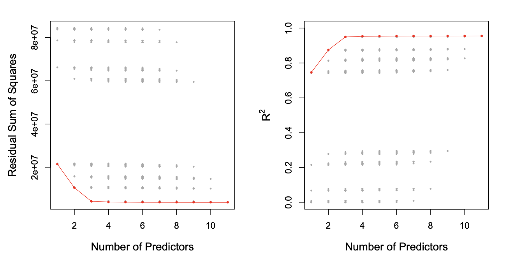
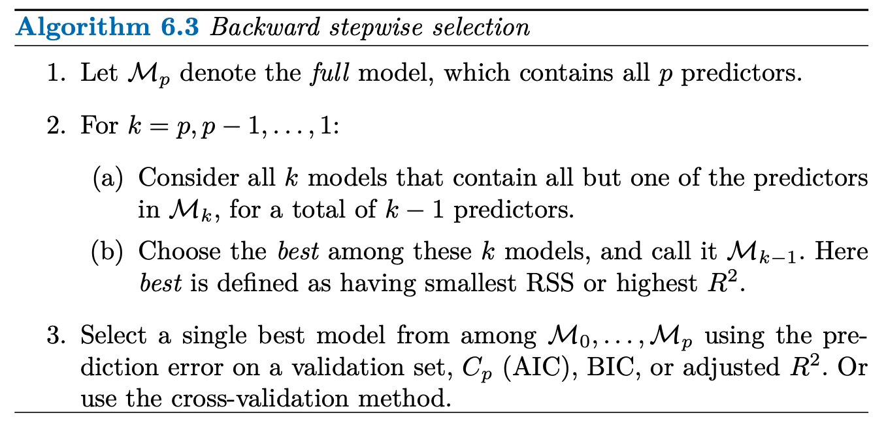

# Linear Model Selection and Regularization

As you only recently learned, the linear model has distinct advantages in terms of inference and, on real-world problems, is often surprisingly competitive in relation to non-linear world problems. Therefore... we're gonna take a look at some ways in which the linear model can be improved by replacing plain least squares fitting with some alternative fitting procedures.

Why might we want to use another fitting procedure instead of least squares? Well let me tell ya son, alternative fitting procedures can yield better prediction accuracy and model interpretability.

* **Prediction Accuracy:** Provided you're actually dealing with a linear problem, the least squares estimate will have a low bias. If n >>, that is, if n, the number of observations, is much larger than p, the number of variables, then the least least squares estimates tend to have low variance, and will perform well on test observations. However, if n is not much larger than p, then there can be a lot of variability in the least squares fit, resulting in overfitting and consequently poor predictions on future observations not used in model training. And if p > n, then there is no longer a unique least squares coefficient estimate: there are infinitely many solutions. Each of these least squares solutions gives zero error on the training data, but typically very poor test set performance due to extremely high variance. By **constraining** or **shrinking** the estimated coefficients, we can often substantially **reduce the variance at the cost of a negligible increase in bias**.

* **Model Interpretability:** It's often the case that some or many of the variables used in a multiple regression model are in fact not associated with the response. Including such irrelevant variables leads to unnecessary complexity in the resulting model, By removing these variables-that is, by setting the corresponding coefficient estimates to zero-we can obtain a model that's more easily interpreted. Now least squares is extremely unlikely to yield any coefficient estimates that are exactly zero.

There are many alternatives, both classical and modern, to using least squares to fit. In this chapter, we discuss three important classes of methods:

* **Subset Selection:** This approach involves identifying a subset of the *p* predictors that we believe to be related to the response. We then fit a model using least squares on the reduces set of variables.

* **Shrinkage:** This approach involves fitting a model involving all *p* predictors. However, the estimated coefficients ar shrunken towards zero relative to the least squares estimates. This shrinkage (also known as **regularization**) has the effect of reducing variance. Depending on what type of shrinkage is performed, some of the coefficients may be estimated to be exactly zero. Hence, shrinkage methods can also perform variable selection.

* **Dimension Reduction:** This approach involves projecting the *p* predictors into an *M*-dimensional subspace, where *M* < *p*. This is achieved by computing *M* different **linear combinations, or projections**, of the variables. Then these *M* projections are used as predictors to fit a linear regression model by least squared.

# Subset Selection

## Best Subset Selection

To perform **best subset selection**, we fit a separate least squares regression for each possible combination of the *p* predictors. That is, we fit all *p* models that contain exactly one predictor, all p(p-1)/2 models that contain exactly two predictors, and so forth. We then look at all of the resulting models, with the goal of identifying the one that is best.

The problem of selecting the *best model* from among the `2**p` possibilities considered by best subset isn't trivial. This is usually broken up into two stages, as described by the following algorithm:

**Step 2** identifies the best model (on the training data) for each subset size, in order to reduce the problem from one of `2**p` possible models to one of *p* + 1 possible models. In the image below, these models form the lower frontier depicted in red:

In order to select a single best model, we must simply choose among these *p* + 1 options. This task must be performed with care, because the RSS of these *p* + 1 models decreases monotonically (meaning it only decreases relative to the *p* + 1 models), and the R**2 increases monotonically, as the number of features included in the model increases.

Therefore, if we use these statistics to select the best model, then we will always end up with a model involving all the variables. The problem is that a low RSS or a high R-squared indicates a model with a low *training* error, whereas we wish to choose a model that has a low *test* error. Therefore, in **Step 3**, we use the error on a validations set, Cp, BIC, or adjusted R2 in order to select among the *M* values. If cross-validation is used to select the best model, then **Step 2** is repeated on each training fold, and the validation errors are averaged to select the best value of *k*.

**Note:** We will get to cross validation eventually, but it's more essential to finish up linear regression first.

Then the model *Mk* fit on the full training set is delivered for the chosen *k*.

An application of best subset selection is shown in the above graph. Each plotted point corresponds to a least squares regression model fit using a different subset of the 10 predictors in the `Credit` data set. Here, the variable `region` is a three-level qualitative variable, and so is represented by two dummy variables, which are selected separately in this case. Hence, there are a total of 11 possible variables which can be included in the model.

Although we have presented best subset selection here for least squares regression, the same ideas apply to other types of models, such as logistic regression. In the case of logistic regression, instead of ordering models by RSS in Step 2, we instead use the **deviance**, a measure that plays the role of RSS for a broader class of models. The smaller the deviance, the better the fit.

While best subset selection is a simple and conceptually appealing approach, it clearly suffers from computational limitations. You're taking all possible combinations of how to approach the data analysis and it gets increasingly demanding as you add predictors. Consequently, **best subset selection becomes computationally infeasible for values of *p* grater than around 40**.

# Stepwise Selection

Stepwise selection methods explore a far more restricted set of models, and are attractive alternatives to best subset selection.

## Forward Stepwise Selection

**Forward stepwise selection** is a computationally efficient alternative to best subset selection. Instead of considering all `2**p` possible models containing subsets of the *p* predictors, forward stepwise considers a much smaller set of models.

It begins with a model containing no predictors, and then adds predictors to the model, one-at-a-time, until all of the predictors are in the model. At each step **the variable that gives the greatest additional improvement to the fit is added to the model**. The algorithm is as follows:

Unlike best subset selection, which involved fitting 