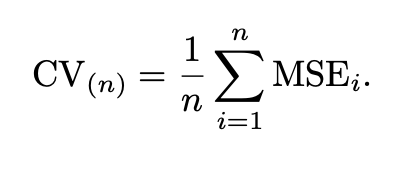

# Resampling Methods

Resampling methods involve repeatedly drawing samples from a training set and refitting a model of interest on each sample in order to obtain additional information about the fitted model.

Resampling approaches can be computationally expensive, because they involve fitting the same statistical method multiple times using different subsets of training data. However, more recent advances in computing power have made this not as big of an issue.

In this chapter, we discuss two of the most commonly used resampling methods, **cross-validation** and the **bootstrap**. 

The process of evaluating a model's performance is known as **model assessment**, whereas the process of selecting the proper level of flexibility for a model is known as **model selection**.

# Cross-Validation

In the absence of a very large designated test set that can be used to directly estimate the test error rate, a number of techniques can be used to estimate this quantity using the available training data. Some methods make a mathematical adjustment to the training error in order to estimate the test error rate (discussed in Chapter 6). Instead, we'll consider a class of methods that estimate the test error rate by *holding out* a subset of the training observations from the fitting process, and then applying the statistical learning method to those held out observations.

## The Validation Set Approach

Suppose that we would like to estimate the test error associated with fitting a particular statistical learning method on a set of observations. The **validation set approach** is a very simple strategy for this task.

It involves randomly dividing the available set of observations into two parts, a **training set** and **validation or holdout** set. The model is fit on the training set, and the fitted model is used to predict the responses in the validation set. This is where we get our estimate of the test error rate.

We'll illustrate all these explanations using the `Auto` dataset. Recall from much earlier that there appears to be a non-linear relationship between `mpg` and `horsepower`, and that a model that predicts `mpg` using `horsepower` and `horsepower**2` gives better results than a model that uses only a linear term. It's natural to wonder whether a cubic or higher-order fit might provide even better results. We answer this question in Chapter 3 by looking at the --values associated with a cubic term and higher-order polynomial terms in a linear regression. But we could also answer this question using the validation method.

We randomly split the 392 observations into two sets, a training set containing 196 of the data points, and a validation set containing the remaining 196 observations. 

In the graph below, the left graph contains validation error estimates for a single split into training and validation data sets. The right graph shows the validation method repeated ten times, each time using a different random split of the observations into a training and validation set.

This illustrates the variability in the estimated test MSE that results from this approach. Based on the variability of these curves, all that we can conclude with any confidence is that the attempted linear fit in these graphs is not adequate for this data.

As you might've notices, the validation set approach has two potential drawbacks:
1. As is shown in the right-hand panel, the validation estimate of the test error rate can be highly variable, depending on precisely which observations are included in the training set and which observations are included in the validation set.
1. In the validation approach, only a subset of the observations-those that are included in the training set rather than in the validation set-are used to fit the model. Since statistical methods tend to perform worse when trained on fewer observations, this suggests that validations set error rate may tend to **overestimate** the test error rate for the model fit on the entire data set.

## Leave-One-Out-Cross-Validation

Also called LOOCV (what a terrible acronym) attempts to address the validation set approach's drawbacks.

Like the validation set approach, LOOCV involves splitting the set of observations into two parts. However, increase of creating two subsets of comparable size, a single observation (*x1*, *y1*) is used for the validation set, and the remaining observations make up the training set. The statistical method is fit on the *n* -1 training observations, and a prediction `y_hat1` is made for the excluded observation, using its value *x1*. Since (*x1*, *y1*) was not used in the fitting process, `MSE1 = (y1 - y_hat1)**2` provides an approximately unbiased estimate for the test error. But even though MSE1 is unbiased for the test error, it's a poor estimate because it's highly variable, since it's based upon a single observation.

Essentially, you're taking one observation to predict and using the rest of the data as training data to predict that one given observation. You repeat this process for all observations. It's a pretty brute force approach.

The LOOCV estimate for the test MSE is the average of the *n* test error estimates:

LOOCV has a couple of major advantages over the validation set approach. First, it has far less bias, and tends to not overestimate the test error rate as much as the validation set approach does. Second, in contrast to the validation approach whiick will yield different results when applied repeatedly due to randomness in the training/validation set splits, performing LOOCV multiple times will always yield the same results.

As you've already guessed, LOOCV has the potential to be expensive to implement. With the least squares linear or polynomial regression, an amazing shortcut makes the cost of LOOCV the same as that of a single model fit. The following formula holds:

where `y_hati` is the *i*th value from the original least squares fit, and *h*i is the leverage.

**Reminder:** Leverage refers to the input value. High leverage indicates an unusual input value.

This is like the ordinary MSE, except that the *i*th residual is divided by 1 - *h*. The leverage lies between 1/*n* and 1, and reflects the amount that an observation influences its own fit. Hence, the residuals for high-leverage points are inflated in this formula by exactly the right amount for this equality to hold.

LOOCV is a very general method, and can be used with any kind of predictive modeling. We could use it with logistic regression or linear discriminant analysis, or any of the methods discussed in later chapters.

## k-Fold Cross-Validation

An 